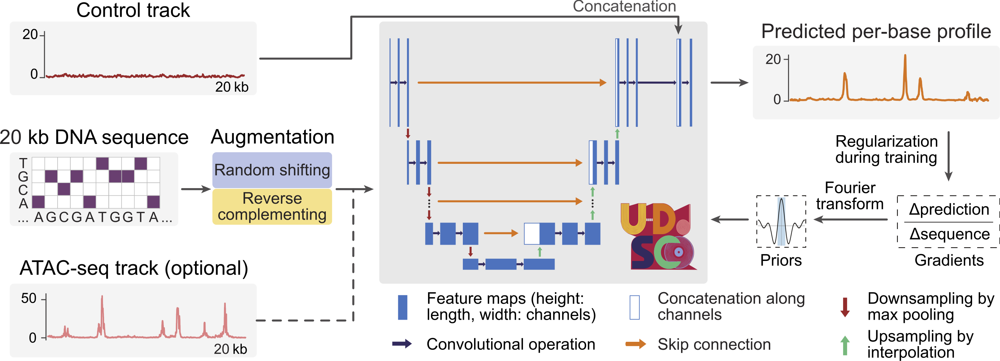

# U-DisCo: A deep learning framework to explore genome-wide interactions of intrinsically disordered proteins with DNA

## Overview



U-DisCo is an interpretable deep learning framework for predicting base-resolution binding profiles of intrinsically disordered proteins (IDPs) to DNA directly from DNA sequences. Designed for use with binding datasets generated by methods such as DisP-seq, U-DisCo provides insights into the cooperative effects of IDP-DNA interactions on gene regulation. Leveraging a U-Net architecture, U-DisCo captures both fine-scale, base-level interactions and long-range dependencies, enabling high-accuracy predictions over distances up to 20 kilobases (kb). The framework also integrates ATAC-seq data to enable robust cross-cell type predictions, facilitating multimodal exploration of IDP binding patterns. U-DisCo can identify distinct motifs predictive of binding activities, cooperative interactions among various IDPs, and strand orientation preferences.

## Installation

To get started with U-DisCo, first clone the repository and install the necessary dependencies:

```bash
git clone https://github.com/LiamT01/u-disco.git
cd u-disco
pip install -r requirements.txt
```

If you are using a GPU, you will need to install the appropriate version of PyTorch rather than the CPU-only version in the requirements file. See the [PyTorch website](https://pytorch.org/get-started/locally/) for installation instructions.

## Data preparation

U-DisCo requires DNA sequences and, optionally, ATAC-seq data, as well as configuration files for model training, evaluation, and motif analysis.

Example configuration files for training and evaluation can be found in the `configs` directory:

- `./configs/*.yaml`: Meta-config files that specify the paths to the other configuration files. They compose the main configuration for training and evaluation.
- `./configs/model_dev/*.yaml`: Config files specifying model architecture and hyperparameters.
- `./configs/raw_data/*.yaml`: Config files specifying paths and other settings for the data. The actual data locations should align with the paths in these files. However, dataset splits (train/val/test) will be generated automatically in the specified `split_dir`.

We provide all data necessary for training and evaluation on the SKNMC cell line, excluding the hg19 genome assembly:

- [Google Drive](https://drive.google.com/file/d/1He-th7c3SyQestqTitOoOHR0jUAXq3lz/view?usp=sharing)

The hg19 genome assembly can be downloaded from [NCBI](https://www.ncbi.nlm.nih.gov/datasets/genome/GCF_000001405.25/).

The complete DisP-seq data can be found in

- [DisP-seq Paper](https://www.nature.com/articles/s41587-023-01737-4)
- [GitHub Repository](https://github.com/rdong08/DISPbind)

## Usage

All main functionality is handled through `main.py`, which supports various commands for training, evaluating, interpreting, and analyzing IDP-DNA binding patterns. Here’s an overview of the available commands:

### Training a model

```bash
python main.py train \
    --meta_config <path_to_meta_config>
```

The `train` command trains a model according to the settings in the specified `meta_config` file. Saved checkpoints, logs, and other outputs will be stored in `./exp`.

### Evaluating a model

```bash
python main.py eval \
    --exp_dir <experiment_directory> \
    [--overwrite_atac_paths <optional_atac_paths>]
```

The `eval` command evaluates, on held-out data, a trained model in the specified `experiment_directory` (e.g., `./exp/train_2024-10-27_16:02:32`). Optional ATAC-seq paths can override those set, if any, in the config (useful for cross-cell type predictions). An `eval.log` file will be saved in the specified experiment directory.

### Interpreting model predictions

```bash
python main.py interpret \
    --split <train|val|test|all> \
    --exp_dir <experiment_directory> \
    --ckpt_name <checkpoint_name> \
    [--seed <random_seed>] \
    [--n_background <number_of_background_sequences>] \
    [--n_samples <number_of_samples>] \
    [--batch_size <batch_size>]
```

This command generates interpretations (SHAP scores) for model predictions on a specific data split. `ckpt_name` should be the name of the checkpoint file in the specified `experiment_directory` (e.g., `epoch_100.pth`). One-hot encoded sequences and SHAP scores will be saved in the specified experiment directory.

### Identifying motifs

```bash
python main.py identify \
    --exp_dir <experiment_directory> \
    --split <train|val|test|all> \
    --max_seqlets <max_seqlets_per_metacluster> \
    --window_size <window_size_in_bp> \
    [--n_leiden <number_of_leiden_clusterings>] \
    [--verbose]
```

Runs TF-MoDISco to identify motifs from model interpretation results on the specified data split. `max_seqlets` should be sufficiently large to capture all motifs (e.g., 1,000,000). `window_size` specifies the size of the window around each input sequence (20 kb long by default) to consider, and regions outside this window will be ignored. An HDF5 file containing the identified motifs will be saved in the specified experiment directory.

### Generating a motif report

```bash
python main.py report \
    --h5py <path_to_motif_hdf5> \
    --output_dir <output_directory> \
    [--meme_db <path_to_meme_database>] \
    [--n_matches <top_tomtom_matches>]
```

Generates a motif report, optionally comparing motifs to a MEME database for motif matching. An HTML report will be saved in the specified output directory.

### Annotating motif patterns

```bash
python main.py annotate \
    --exp_dir <experiment_directory> \
    --split <train|val|test|all> \
    --h5py_path <path_to_motif_hdf5> \
    --annot_yaml_path <path_to_annotation_yaml> \
    --output_dir <output_directory>
```

Annotates motifs by assigning names to motifs based on their similarity to known motifs. The annotation YAML file should contain the names of the motifs and their corresponding identifiers (keys) in the HTML report. An example annotation YAML file is as follows:

```yaml
actual_window_size: 20000  # Window size for training
trim_window_size: 10000  # Window size for motif identification
patterns:
  - name: 'Motif 1'
    key: 'pos_patterns.pattern_0'
    is_forward: true
  - name: 'Motif 1'
    key: 'pos_patterns.pattern_1'
    is_forward: false
  - name: 'Motif 2'
    key: 'pos_patterns.pattern_6'
    is_forward: true
```

Note that:

- The `name` field assigns a name to the motif pattern. Patterns with the same name will be merged into a single motif.
- The `key` field specifies the pattern name in the first column of the HTML report.
- The `is_forward` field specifies whether you think the reported forward motif pattern is the actual forward motif pattern. Set this to `false` if you think the reported forward motif pattern is the reverse complement of the actual forward motif pattern.

Annotated motif instances in YAML format will be saved in the specified output directory.

### Calculating motif co-occurrences

```bash
python main.py co_occurrence \
    --config_path <path_to_config> \
    --annot_yaml_path <path_to_annotation_yaml> \
    --motif_instances_yaml_path <path_to_motif_instances_yaml> \
    --output_dir <output_directory>
```

Calculates the co-occurrences between motifs. The configuration file specifies parameters for motif co-occurrence calculation. Here's an example:

```yaml
num_trials: 100
d_ranges:
  - low: 0
    high: 150
  - low: 150
    high: 300
  - low: 300
    high: 500
  - low: 500
    high: 999999999
seed: 0
```

- `num_trials`: The number of trials (number of shuffles)
- `d_ranges`: The distance ranges for the calculation
- `seed`: Random seed for reproducibility

The output contingency matrices, in JSON format, will be saved in the specified output directory.

### Analyzing strand orientation preferences

```bash
python main.py preference \
    --config_path <path_to_config> \
    --annot_yaml_path <path_to_annotation_yaml> \
    --motif_instances_yaml_path <path_to_motif_instances_yaml> \
    --output_dir <output_directory>
```

Determines motif binding preferences for strand orientations. The configuration file has the exact same format as the motif co-occurrence calculation configuration file. However, you may want to specify different, finer-grained distance ranges for this analysis.

The output, also in JSON format, will be saved in the specified output directory. Note that:

- An orientation of 1 stands for the forward strand, and 0 stands for the reverse strand.
- `shuffled_counts` of shape (`num_trials`, 2) are counts within and outside a particular distance range for each shuffled version of the motif instances.
